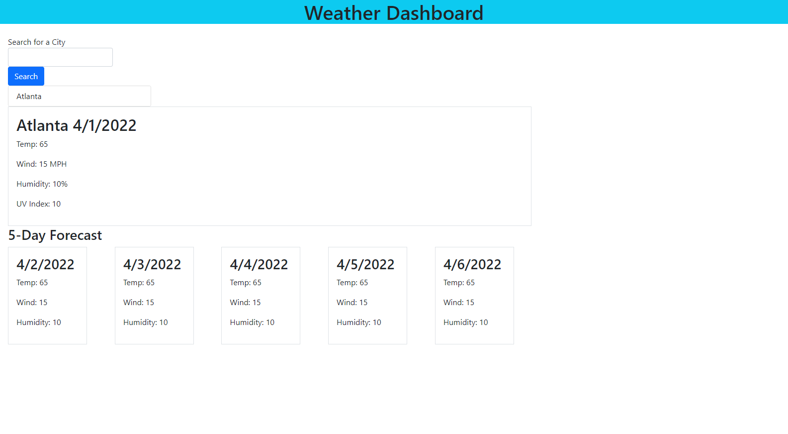

---
## Description

Given a screenshot of a weather dashboard, my task is to create a similar weather dashboard using HTML, JavaScript and CSS, which allows the user to search for a city and have the current and future weather conditions displayed on the page.

---
## Table of Contents

  - [Installation](#installation)
  - [Usage](#usage)
  - [Tests](#tests)
  - [Contribute](#contribute)
  - [Credits](#credits)
  - [License](#license)


---
## Installation

This application can be run in a browser.

- [Git Hub Repository](https://github.com/areitan/Weather_Dashboard)
- [Weather Dashboard Deployed Application](https://areitan.github.io/Weather_Dashboard/)


---
## Usage

This application is run in a browser and takes user input to fetch information from an API. 

### Weather Dashboard Example


### Deployed Weather Dashboard Screenshot



---
## Tests

Tests were preformed by manually entering data.


--- 
## Contribute

In order to create this application, I used the skills I have at the moment. I am open to suggestions, if there are ways to streamline the code or if any bugs are found.

---
## Credits

- [OpenWeather website](https://openweathermap.org/)
- [Bootstrap: Introduction](https://getbootstrap.com/docs/5.1/getting-started/introduction/)
- Trilogy Education Services, LLC for the starter code and example code throughout the week 6 exercises.
- My tutor

### Questions

For any question, please contact me on GitHub at: [areitan](https://github.com/areitan) or by email at <areitan@fredhutch.org>.

---

## License

Copyright (c) ```<2022> <copyright April Reitan>```

MIT License:
Permission is hereby granted, free of charge, to any person obtaining a copy
of this software and associated documentation files (the "Software"), to deal
in the Software without restriction, including without limitation the rights
to use, copy, modify, merge, publish, distribute, sublicense, and/or sell
copies of the Software, and to permit persons to whom the Software is
furnished to do so, subject to the following conditions:

The above copyright notice and this permission notice shall be included in all
copies or substantial portions of the Software.

THE SOFTWARE IS PROVIDED "AS IS", WITHOUT WARRANTY OF ANY KIND, EXPRESS OR
IMPLIED, INCLUDING BUT NOT LIMITED TO THE WARRANTIES OF MERCHANTABILITY,
FITNESS FOR A PARTICULAR PURPOSE AND NONINFRINGEMENT. IN NO EVENT SHALL THE
AUTHORS OR COPYRIGHT HOLDERS BE LIABLE FOR ANY CLAIM, DAMAGES OR OTHER
LIABILITY, WHETHER IN AN ACTION OF CONTRACT, TORT OR OTHERWISE, ARISING FROM,
OUT OF OR IN CONNECTION WITH THE SOFTWARE OR THE USE OR OTHER DEALINGS IN THE
SOFTWARE.